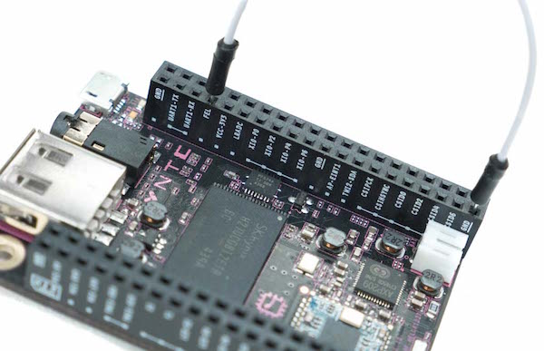

# What is needed!
* Windows 10 machine!
* USB A to micro B cable
* USB charger for power
* USB to uart cable with jumper wires(PL2303 USB to Serial cable)
* Internet connection
* Chrome browser (updated), on windows machine, only for flashing
* Wifi router for connecting CHIP to network
* Jumper wire for CHIP to enter flashing mode
* Putty for windows installed and working

# What will it do!
This will setup CHIP for use with software i use for programing in Gforth and c/c++ and a wifi connection to ssh into CHIP headlessly!

# Flashing the CHIP for headless use!
* [CHIP's online documents for flashing](http://docs.getchip.com/chip.html#flash-chip-with-an-os)

Need to get driver for flashing so open up chrome browser and go to the following page and install the driver!
* [CHIP chrome flasher](http://flash.getchip.com/)

Place jumper wire connecting Pin 7 and Pin 39 on header U14 (FEL pin and GND). The image shows this!

Now plug the USB micro B end into CHIP and the other USB end into windows computer!  Note ensure you have the above web page open
for the flashing process.  Once connected and powered the web page will change and show a message about reading CHIP.
If this process does not return shortly then the USB cable is not going to work find a new one. Also restarting Chrome seems to work sometimes if issues continue!
Once the CHIP has been identified you are given options for what to flash onto the CHIP.  Pick Headless OS then press
the flash button at the bottom of the new window that pops up! This will take some time just let it continue (5 to 10 min).
Note there maybe messages from windows about USB device not detected just ignore them!  
The pop up window should tell you when it is done and if all is ok with flashing!

# Configure CHIP for wifi connection to a hotspot or wifi router!
[CHIP Headless online documents](http://docs.getchip.com/chip.html#headless-chip)

### Connect to CHIP via USB to Serial cable
Get the USB to serial cable.  The above link shows a driver page download for this USB to serial cable but that driver does not work
with older devices of the company that makes the driver so the link for the older driver that will uninstall and fix the driver to allow older devices to work
is here [older pl2303 windows 10 driver](http://www.totalcardiagnostics.com/support/Knowledgebase/Article/View/92/0/prolific-usb-to-serial-fix-official-solution-to-code-10-error) .
Once driver is installed plug the USB to serial device into computer and ensure it shows up as working in device manager.
Note the com port number and set the com port data rates up for 115200 baud, no parity, 1 stop bit, no flow control, 8 data bits.
Then add jumpers to the other end of the USB to serial device and connect to CHIP using only black, white and green connectors.
Note do not use the red power connection from the USB to serial device ( red is power from usb and might be +5vdc so not compatible with CHIP)!

* black to CHIP Gnd U14 pin1
* white (tx) to CHIP uart1-tx U14 pin3
* green (rx) to CHIP uart1-rx U14 pin5

Now power the CHIP with a usb power adapter.  Open putty on windows machine and connect to the port number from above step ensuring
that the speed is setup as 115200 baud.  This should open up a window and connection that will ask for username and password. The username is chip
and the password is chip at the beginning! You might need to press enter to get the username prompt to show up!

### Connect to CHIP via USB cable and windows 10 machine directly
This is possible but it did not work on headless os 4.4 until i found this [CHIP forum message about this not working properly](https://bbs.nextthing.co/t/fix-cdc-composite-gadget-4-4-driver-issue-on-windows/7458/18). If the link does not work then
search for
>CDC Composite Gadget” 4.4 driver issue on Windows.  
The long and short of it is you need a new windows 10 driver [here](https://s3-us-west-2.amazonaws.com/getchip.com/extension/drivers/windows/InstallDriver44.exe).  Get the driver install it!
Now plug newly flashed headless os 4.4 CHIP device into a usb port on the windows 10 machine and in a moment it will show up as a com port.
Open device manager and find the com port that is assign to the CHIP.  Open the port ensure it is set to 115200 baud, no parity, 1 stop bit, no flow control, 8 data bits. Open a putty serial session and set it to the same settings as last sentence.  Once connected enter the user name chip and the password chip.

[CHIP online wifi setup documents](http://docs.getchip.com/chip.html#wifi-connection)

Now to set up CHIP to connect to the hotspot or wifi router. In the putty session enter the following to see the wifi router:

`nmcli device wifi list`

You should see the ssid for your hotspot or router!
Do the following to connect to your hotspot or router.  Note put your SSID and your password in the following where it shows to:

`sudo nmcli device wifi connect '(your wifi network name/SSID)' password '(your wifi password)' ifname wlan0`

Test your connection as follows:

`nmcli device status`

You should see a connection to your wifi ssid on wlan0 now in the list!
Now issue this command to find the current ip address that the CHIP is connected to (in the inet list):

`ip addr show dev wlan0`

Open another putty session and connect to this ip via ssh.  Note if this does not work it may be due to ssh not configured or installed
yet on the CHIP.  I have had this issue with early versions of the headless os.  If this is the case the next section will have info on how to install
ssh and configure it along with other software.

# Update Remove and Installing software
